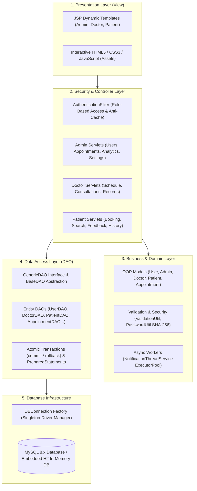

# 🏥 MetroCare — Online Healthcare Management System

<p align="center">
  
  
  
  
  
  
</p>

A full-stack **Java Enterprise Web Application** engineered to provide seamless hospital operations, doctor availability scheduling, conflict-free dynamic appointment booking, digital prescriptions, and role-based administration portals.

---

## 👥 Project Team

| Role | Name |
| :--- | :--- |
| 👑 **Team Leader** | **Mayank Patel** |
| 👨‍💻 **Team Member** | **Kabir Kumar** |
| 👨‍💻 **Team Member** | **Abhinav Kumar** |
| 👨‍💻 **Team Member** | **Shashank Mishra** |

---

## 🏛️ Code & System Architecture

MetroCare follows an enterprise-grade **4-Tier MVC (Model-View-Controller) Architecture** ensuring high cohesion, loose coupling, and clear separation of concerns:



### 🧩 Architectural Layers & Design Patterns

| Layer | Primary Responsibilities | Design Patterns & Technologies |
| :--- | :--- | :--- |
| **Presentation (View)** | Renders dynamic role-tailored dashboards, consultation booking UI, and interactive feedback forms | JSP, JSTL, HTML5, Custom Responsive CSS, Vanilla JS |
| **Controller & Security** | Intercepts HTTP requests, verifies session authorization, validates inputs, and coordinates responses | `HttpServlet` (`doGet`/`doPost`), `Filter`, Front-Controller dispatching |
| **Domain & Business** | Implements core business logic, user inheritance hierarchy, validation, and async tasks | OOP Inheritance, Polymorphism, Singleton (`NotificationThreadService`) |
| **Persistence (DAO)** | Handles parameterized database queries, prevents SQL injection, and manages atomic transactions | Data Access Object (DAO) Pattern, `GenericDAO<T, ID>`, PreparedStatements |
| **Database (JDBC)** | Dual-database connectivity supporting production MySQL and zero-config in-memory H2 | JDBC Connection Factory, Driver Manager, Connection Pooling |

---

## 🌟 Key Features & Modules

### 👑 Administrator Portal
- **User Management**: Activate/deactivate accounts and assign doctor/patient profiles.
- **Master Appointment Hub**: View and manage all hospital consultations across departments.
- **Analytics Dashboard**: Real-time KPI summaries, department workloads, and revenue metrics.
- **System Settings**: Configure hospital parameters, business rules, and operating hours.

### 🩺 Doctor Portal
- **Shift & Availability Manager**: Define consultation schedules, custom hours, and slot intervals (15m, 30m, 60m).
- **Patient Queue**: View upcoming consultations, accept/cancel requests, and track daily caseload.
- **Digital Medical Records**: Issue diagnosis reports, electronic prescriptions, and follow-up plans.
- **Patient Reviews**: Read verified patient feedback and track overall performance ratings.

### 🧑‍⚕️ Patient Portal
- **Smart Doctor Search**: Filter specialists by department, experience, fee, and availability.
- **Dynamic Slot Booking**: Real-time conflict-free appointment booking with automatic slot calculation.
- **Medical History**: Access past clinical notes, diagnosis records, and download prescriptions.
- **Doctor Feedback**: Submit star ratings and clinical reviews after consultation completion.

---

## 🔑 Demo User Credentials

| Portal / Role | Email Address | Password | Profile Description |
| :--- | :--- | :--- | :--- |
| 👑 **Administrator** | `admin@healthcare.com` | `admin123` | Hospital Administrator with analytics and full user control |
| 🩺 **Doctor (Cardiology)** | `dr.sharma@healthcare.com` | `doctor123` | Dr. Rajesh Sharma, MBBS, MD, DM |
| 🩺 **Doctor (Dermatology)** | `dr.patel@healthcare.com` | `doctor123` | Dr. Sneha Patel, MBBS, MD |
| 🩺 **Doctor (Neurology)** | `dr.ananya@healthcare.com` | `doctor123` | Dr. Ananya Roy, MBBS, MD, DM |
| 🧑‍⚕️ **Patient (Active)** | `rahul@gmail.com` | `patient123` | Rahul Verma (Active appointments & prescriptions) |
| 🧑‍⚕️ **Patient (New)** | `priya@gmail.com` | `patient123` | Priya Nair |

---

## ⚡ Quick Start & Execution

### Option 1: Instant Local HTML/UI Preview (Zero Setup)
Preview all interactive views (Landing page, Patient Portal, Doctor Portal, Admin Dashboard, Booking Modal):
```bash
# Double click start_server.bat OR run:
node server.js
```
👉 Open your browser at **[http://localhost:3000/](http://localhost:3000/)** or double click [index.html](file:///c:/Users/mayan/Downloads/java_project/index.html).

---

### Option 2: Run with Maven (Embedded Tomcat)
```bash
mvn clean tomcat7:run
```
👉 Access the live Java web portal at: **`http://localhost:8080/`**

---

### Option 3: Deploy WAR to Apache Tomcat Server
1. Build the production WAR package:
   ```bash
   mvn clean package
   ```
2. Copy `target/healthcare.war` into Tomcat's `webapps/` directory.
3. Start Tomcat and navigate to: `http://localhost:8080/healthcare/`
